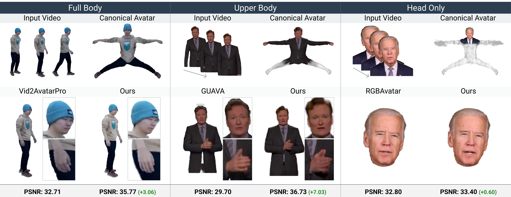

<div align="center">

# FlexiAvatar: Unified 3D Gaussian Human Avatars<br>Under Arbitrary Body Visibility

**ECCV 2026**

### [Project Page](https://yihalem1.github.io/FlexiAvatar/) &nbsp;|&nbsp; [arXiv](https://arxiv.org/abs/2607.19100)

</div>

<p align="center">
  
</p>

<p align="center">
<em>From monocular video under arbitrary body visibility, FlexiAvatar reconstructs animatable 3D
Gaussian avatars within a single pipeline, outperforming state-of-the-art full-body, upper-body,
and head-only methods.</em>
</p>

---

## Getting started

The pipeline runs in two stages, each a self-contained project with its own conda environment and
its own README. Run them in order.

| | Stage | What it does | Guide |
|---|---|---|---|
| **1** | [`smplx_fitting/`](smplx_fitting/) | Fits SMPL-X + FLAME to a monocular video. Recovers cameras, pose, expression and a personalized template, and unwraps a face texture. | [README](smplx_fitting/README.md) |
| **2** | [`avatar_training/`](avatar_training/) | Trains the visibility-aware 3D Gaussian avatar on the fitted sequence, then animates and evaluates it. | [README](avatar_training/README.md) |


---

## 🙏 Acknowledgements

This codebase is built on top of [ExAvatar](https://github.com/mks0601/ExAvatar_RELEASE); its MIT
license retained in [`LICENSE`](LICENSE). We thank the authors of the
following works for releasing their code:

- **[ExAvatar](https://github.com/mks0601/ExAvatar_RELEASE)**
- **[3D Gaussian Splatting](https://github.com/graphdeco-inria/gaussian-splatting)**
- **[SMPLest-X](https://github.com/SMPLCap/SMPLest-X)**


## Citation

```bibtex
@inproceedings{tiruneh2026flexiavatar,
  title     = {FlexiAvatar: Unified 3D Gaussian Human Avatars Under Arbitrary Body Visibility},
  author    = {Tiruneh, Yihalem Yimolal and Ali, Muhammad Salman and Jeong, Uyoung and
               Khan, Muneeb A. and Sayem, MD Khalequzzaman Chowdhury and
               Bayramgeldiyev, Allanur and Bhattarai, Binod and Baek, Seungryul},
  booktitle = {European Conference on Computer Vision (ECCV)},
  year      = {2026}
}
```
---
